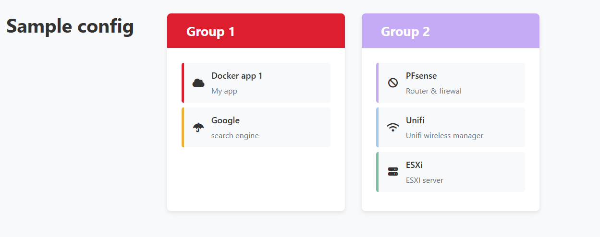

# Homepage Links

A lightweight, containerized web application that serves as a customizable homepage with organized links and beautiful color palettes. Built with Go and designed to be simple yet visually appealing.

## Features

- 🎨 Customizable color palettes for different link groups
- 🔗 Organized link groups with icons and descriptions
- 🚀 Fast and lightweight (single binary)
- 🔄 YAML-based configuration
- 💾 Optional configuration caching
- 🐳 Docker support
- 📱 Responsive design

## Screenshots



*Example of the homepage with different color palettes and organized link groups*

## Quick Start

### Using Docker

```bash
docker run --rm --name home-links \
  -p 8080:8080 \
  -v /path/to/your/config.yaml:/data/config.yaml:ro \
  h213/homepage-links:latest
```

### Environment Variables

| Variable | Description | Default |
|----------|-------------|---------|
| `APP_LISTEN_ADDR` | Address and port to listen on | `:8080` |
| `APP_YAML_PATH` | Path to the YAML configuration file | `/data/config.yaml` |
| `APP_CACHE_SECONDS` | Cache duration for YAML config in seconds (0 = disabled) | `0` |

## Configuration Caching

By default, the application reads the YAML configuration file on every request. This ensures that any changes to the configuration are immediately reflected but can impact performance if the file is large or if there are many requests.

To enable caching, set the `APP_CACHE_SECONDS` environment variable to the desired cache duration in seconds. For example:
- `APP_CACHE_SECONDS=60` - Cache for 1 minute
- `APP_CACHE_SECONDS=300` - Cache for 5 minutes
- `APP_CACHE_SECONDS=3600` - Cache for 1 hour

When caching is enabled:
- The YAML file is read only once during the cache period
- All requests within the cache period use the in-memory configuration
- After the cache expires, the next request will reload the configuration
- The application logs when the configuration is cached and for how long

This is particularly useful in production environments where the configuration doesn't change frequently and you want to reduce disk I/O.

## Configuration

The application is configured using a YAML file. Here's an example configuration:

```yaml
title: My Homepage

colors:
  default:
    - '337ab7'
    - '5cb85c'
    - '5bc0de'
    - 'f0ad4e'
    - 'd9534f'
  pack:
    - 'DD1E2F'
    - 'EBB035'
    - '06A2CB'
    - '218559'
    - 'D0C6B1'
    - '192823'

groups:
  - name: Development
    palette: pack
    items:
      - name: GitHub
        url: /github
        link: https://github.com
        description: Code hosting platform
        icon: fa-github

      - name: Docker Hub
        url: /docker
        link: https://hub.docker.com
        description: Container registry
        icon: fa-docker

  - name: Monitoring
    palette: default
    items:
      - name: Grafana
        url: /grafana
        link: http://localhost:3000
        description: Metrics dashboard
        icon: fa-chart-line
```

### Configuration Structure

- `title`: The page title
- `colors`: Color palettes that can be used by groups
  - Each palette is a list of hex color codes (without the # prefix)
- `groups`: List of link groups
  - `name`: Group name
  - `palette`: Name of the color palette to use
  - `items`: List of links in the group
    - `name`: Link name
    - `url`: Short URL path (used for routing)
    - `link`: Actual target URL
    - `description`: Optional description
    - `icon`: Optional Font Awesome icon class

## Icons

The application uses Font Awesome icons. You can use any icon from the Font Awesome library by specifying the icon class:

- Regular icons: `far fa-icon-name`
- Solid icons: `fas fa-icon-name`
- Brand icons: `fab fa-icon-name`
- Light icons: `fal fa-icon-name`

Or simply use the short form: `fa-icon-name` (defaults to solid style)

## Development

### Local Development

1. Clone the repository
2. Create your `config.yaml` file
3. Run locally:
```bash
go run main.go
```

Or use the provided script:
```bash
run-local.sh
```

### Building Docker Image

```bash
docker build -t h213/homepage-links:latest .
```

## License

This project is open source and available under the MIT License.